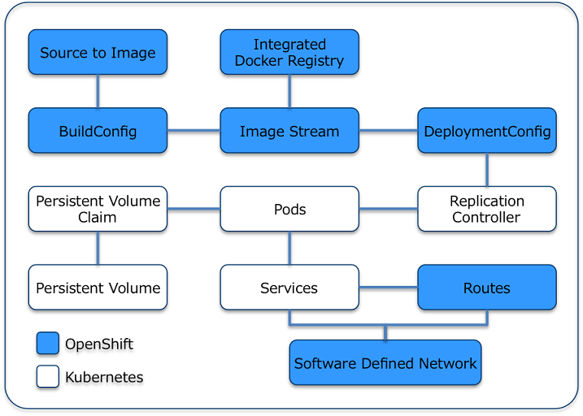

## インフラ技術の歴史

#### Github@KY0000

---

### パブリッククラウドの歴史

--

### AWS

- 2006年設立
- Amazon が提供
- パブリッククラウドのトップ３の一つ。

--

### GCP

- 2008年スタート
- Google が提供
- パブリッククラウドのトップ３の一つ。

--

### Azure（アジュール）

- 2008年発表
- 2010年サービス開始
- Microsoft
- パブリッククラウドのトップ３の一つ。

---

### OpenStack

- https://ja.wikipedia.org/wiki/OpenStack
- はじまりは2010年10月
- Rackspace Hosting と NASA が始めた
- 2012年9月 OpenStack Foundation 発足・OpenStack の運用を移管
- AWS を参考に高度に仮想化したIaaSを誰でも構築するための技術

--

## 最初にして最後の目的

#### インフラ構築/管理に関する自動化基盤の提供

--

### OpenStack を構成する要素

- Nova (コンピュート)
- Neutron (ネットワーキング)
- Cinder (ブロックストレージ)
- Keystone (アイデンティティサービス)
- Glance (イメージサービス)
- Swift (オブジェクトストレージ)
- Horizon (ダッシュボード)

~~いい感じに厨二っぽい~~

--

## 使いどころ

どうしてもパブリッククラウドを使いたくない、という場合はオンプレ環境にOpenStackを構築することで、
リソースの調達等が自動化でき、コストダウン可能になる。  
しかし、やはり自社で用意できるデータセンターの規模には限界があり、コストもかかるので大人数で巨大なリソースを共有するパブリッククラウドを使った方がメリットが大きいと言える。

--

### 参考サイト

[おぷすたディストリビューションビジネスは何処へ向かうのか](https://qiita.com/jyoshise/items/76444753ce169393239a)

---

### Docker

- 2013/3/13にリリース
- ソフトウェアコンテナ内のアプリケーションのデプロイメントを自動化するオープンソースソフトウェアである。
- dotCloud社 ⇒ Docker社。dotCloud社のPaaSクラウドサービスのシステムが元になって作成された。

--

### 使いどころ

- テスト環境等、環境を使い捨てにしたい
- 1コンテナー1プロセスで動かせる場合

--

## ここがやばい

- 1コンテナー1プロセスで動かす前提
- コンテナ管理
- イメージ管理

--

### 技術要素

- Linuxコンテナ技術:　libcontainer
- ファイルシステム： aufs、btrfs、Device Mapper、OverlayFS、vfs
- etc..

--

### 従来の仮想化技術と比べると？

- ハイパーバイザー型製品と比べて、ディスク使用量が少ない
- インスタンス作成・起動が速い
- 性能劣化がほとんどない

--

### 付随サービス

- Docker Hub
  - コンテナイメージの公式オープンリポジトリ的な奴
- Docker Swarm
  - 正式にはサービスではなく、動作モードの一つ
- Docker Composer
  - これもサービスではない

--

### Docker Hub

- クラウドベースの Docker レジストリサービス
- 1アカウントにつき１つだけプライベートリポジトリを作成可能
- [プラン表](https://hub.docker.com/account/billing-plans/)

--

### DockerCompose

- HISTORY
  - 2013/12/21 v0.0.1 登場
  - 2014/10/17 v1.0.0 登場
- どういうもの？
  - docker-compose.yml が核となり、まとめて諸々定義する
  - コンテナオーケストレーションツール

--

### 参考サイト

- [Dockerのメリット・デメリット](http://bit.ly/2zrR6Rx)
- [Dockerの誤解と神話。識者が語るDockerの使いどころとは？ Docker座談会（前編）](https://thinkit.co.jp/article/2127)

---

### Kubernetes

- 2014年6月7日 発表
- 2015年7月21日 v1.0 リリース
- ホストのクラスタ間でアプリケーション・コンテナの配置、スケーリング、および操作を自動化するための「プラットフォーム」を提供することを目的として設計されています。
- 元々Googleによって設計され、v1.0 リリース時に合わせて設立された Cloud Native Computing Foundation(CNCF)にシードテクノロジーとして寄贈されました。

--

#### Case Studies

- box
- ebay
- ポケモンGO
- SAP
- Yahoo!Japan

--

#### 参考サイト

- [K8s Bootcamp](https://kubernetesbootcamp.github.io/kubernetes-bootcamp/index.html)
- [k8s 公式サイト](https://kubernetes.io/)
- [k8s 公式ブログ](http://blog.kubernetes.io/)
- [k8s on openstack](http://openstackdays.com/wp-content/uploads/2017/08/4-B3-8.pdf)

---

### OpenShift

- Redhat 社が提供する Kubernetes の拡張。
- Kubernetes はコミュニティベースで運用されており、サポート等欲しい場合は OpenShift Enterprise を使用した方が良いと思われます。
- [TestDrive on Cloud](https://www.openshift.com/container-platform/trial.html)

--

### OpenShift と Kubernetes の違い①

[参考:OpenShiftとKubernetesのちがうところ](http://jp-redhat.com/openeye_online/column/omizo/4093/)
1. アクセスコントロール
  1. K8SのNameSpace機能を拡張し、DockerImage へのアクセスポリシーを設定することが可能
1. 便利なクラスタ管理コンポーネント
  1. Integrated Docker Registry
  1. Software Defined Network
  1. Build Configuration
  1. Deployment Configuration
  1. Source to Image
  1. Image Stream
  1. Route

--

### OpenShift と Kubernetes の違い②

--

### OpenShift Enterprise

- PaaS環境の構築から自社で行うタイプ
- [マニュアル](https://access.redhat.com/documentation/en-us/openshift_container_platform/?version=3.7)
- [必要スペック(3.6)](https://access.redhat.com/documentation/en-us/openshift_container_platform/3.6/single/installation_and_configuration/index)

--

### スペック表

|item                   |Master     |Node             |
|:-                     |:-         |:-               |
|BaseOS(min)            |RHEL7.3/7.4|RHEL7.3 or 7.4   |
|NetworkManager         |-          |1.0(min)         |
|vCPU/RAM(min)          |2 / 16GB   |1 / 8GB          |
|HDD(/var/)             |40GB       |15GB             |
|HDD(/usr/local/bin)    |1GB        |1GB              |
|HDD(/tmp)              |1GB        |1GB              |
|HDD(forDocker'sStorage)|-          |15GB(unallocated)|

--

### OpenShift Online3

- フルマネージドの OpenShift 。
- 基本的な考え方は Kubernetes と同様
- まだちょっと不安定な感じがするので使わない方が無難。

--

### OpenShift Dedicated 

- OpenShift Online の占有ホスト版。
- 2016年1月25日

--

### OpenShift Origin 

- The Open Source Container Application Platform
- オープンソースで開発中のプロジェクト

---

### コンテナのリソース監視

1. Datadog でリソース監視
1. Zabbix でゴリゴリやる
1. cAdviser(k8s付属) ⇒ fluentd ⇒ zabbix 方式
1. [Grafana App for Kubernetes](https://github.com/grafana/kubernetes-app)

--

### fluentd

- Exactly Once は必要ですか？
- At Most Once で良ければデータ転送ツールの標準として Fluentd でいかがでしょうか？

### fluent-plugin-cadviser

- SEO 適正評価サービスの WooRank が開発したプラグイン。
- Fork して使用すればよいかと思います。

### fluent-plugin-zabbix

- sfujiwara なる謎の人物が作成しているプラグイン。

---

## 目次

[スライド集](./index.html)

